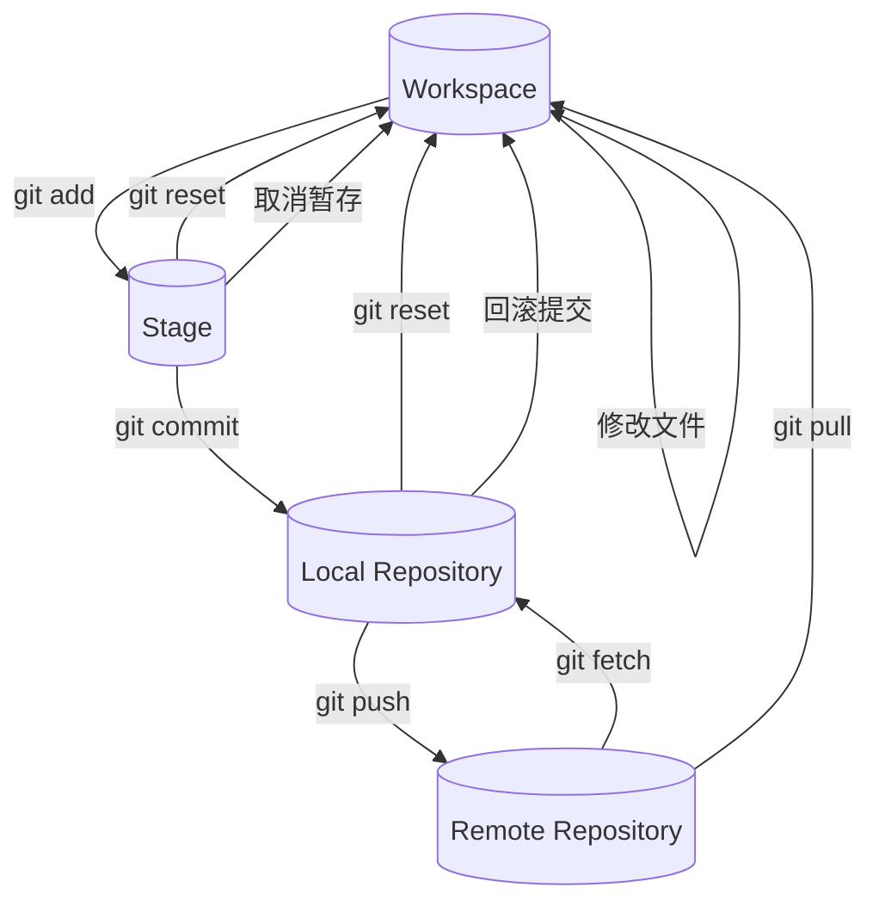

## git

### 概念

`仓库(repository):`已经写好，可以用的整个目录及其中的代码（.git中还有对仓库的文件及其内容操作历史）

`克隆(clone):`github上放的就是一个个仓库，要想将仓库的内容拷贝一份到本地

1. 下载zip，解压缩到本地，这样不会保留.git，只会下载源代码
2. git命令克隆到本地
   1. https git clone github地址
   2. ssh

但直接下载，有有些情况会出问题，如果仓库使用了Git子模块（即指向另一个Git仓库的链接），通过直接下载的ZIP文件通常不会包含这些子模块的内容。你只会看到一个空目录或指向子模块的占位符文件。

`添加(add):`将文件放在一个tmp区（Stage），用于小修小改的保存和返回

`提交(commit):`将多次小改的内容提交，作为仓库的回溯点，也能回滚之前的版本

`推送(push):`将本代的代码提交到远程仓库，执行前，为了保证代码的一致性，可以用pull，最后push

`拉取(pull):`把远程仓库相比多出来的加进去或者把多的删除掉

`fetch:`是一个从远程仓库获取最新更改但不自动合并的命令，它会将远程仓库中的所有分支的最新提交记录下载到本地，并将这些更新存储在本地的远程分支（例如 origin/master）中，但不会修改你当前的工作分支。

`对比(giff):`对比任意git树之间的差异
~~~
#这个命令会显示当前工作目录中未add的文件改动
git diff

#这个命令会显示暂存区与上一次提交之间的差异，也就是下一次提交的内容
git diff --cached

#这个命令会显示 commit1 和 commit2 之间的所有差异
git diff <commit1> <commit2>
~~~




常用命令的combo版本
```
初始化仓库（使仓库中拥有分支）
git init
关联远程仓库（使本地仓库与远程仓库）
git remote add origin（origin只是个仓库别名） 远程仓库URL
添加更改
git add <filename>
提交
git commit -m "message"

拉取
git pull repository-name branch-name
推送
git push repository-name branch-name 

克隆（将远程仓库的内容首次本地取用时，完全复制仓库内容，包括git版本信息）
git clone remote-url

比较两次版本的差异
git diff id1 id2
git diff id1 HEAD(最新版本)

```
